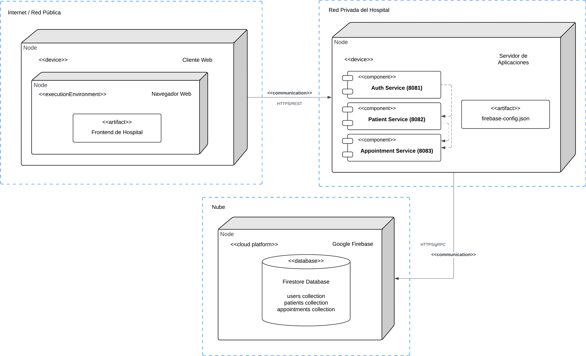

# Sistema Hospitalario

## Arquitectura General (diagrama de despliegue)



1. **AuthService**: Gestión de usuarios y autenticación
2. **PatientService**: Gestión de información médica de pacientes
3. **AppointmentService**: Gestión de citas médicas

## Mecanismos de Integración

### 1. Autenticación basada en JWT

El elemento central de integración entre los microservicios es un sistema de autenticación basado en tokens JWT (JSON Web Tokens).

**Flujo de Autenticación**:
1. Un usuario se registra o inicia sesión a través del AuthService
2. El AuthService genera un token JWT firmado que incluye:
   - El identificador del usuario (userId/uid)
   - El rol del usuario (paciente, medico, admin)
   - Firma digital usando una clave secreta compartida
   - Fecha de expiración
3. El cliente almacena este token
4. El cliente incluye el token en el header Authorization de todas las solicitudes a cualquier microservicio
5. Cada microservicio valida el token de forma independiente usando la misma clave secreta
6. Si el token es válido, el microservicio permite el acceso basado en el rol incluido en el token


### 2. Control de Acceso Basado en Roles (RBAC)

Los roles definidos en AuthService se utilizan de manera consistente en todos los microservicios:

- **admin**: Acceso completo a todo el sistema
- **medico**: Acceso a gestión de pacientes y citas
- **paciente**: Acceso limitado a su propia información

## Seguridad en la Integración

### Clave Secreta Compartida

Todos los microservicios utilizan la misma clave secreta para validar tokens JWT. Esta clave está configurada en cada servicio:

```properties
# En cada application.properties
jwt.secret=MySecretKeyForJWTHospitalSystem2024
```

### Validación del Token

Cada microservicio valida el token de forma independiente:

1. Verifica la firma digital usando la clave secreta compartida
2. Comprueba que el token no haya expirado
3. Extrae el userId y el rol para control de acceso

### Verificación de Permisos

Cada microservicio implementa su propia lógica de autorización basada en roles:

```java
// Ejemplo en controllers
@PreAuthorize("hasAnyRole('ADMIN', 'MEDICO')")
@PreAuthorize("hasAnyRole('ADMIN', 'MEDICO', 'PACIENTE')")
@PreAuthorize("hasRole('ADMIN')")
```

Además, se realizan verificaciones adicionales para asegurar que un paciente solo pueda acceder a su propia información.

## Ventajas de esta Arquitectura de Integración

1. **Bajo acoplamiento**: Los microservicios pueden funcionar y evolucionar de manera independiente
3. **Escalabilidad horizontal**: Cada servicio puede escalar según sus necesidades específicas
4. **Consistencia en seguridad**: El mismo mecanismo JWT se usa en todo el sistema
5. **Simplicidad**: No requiere infraestructura adicional de comunicación entre servicios